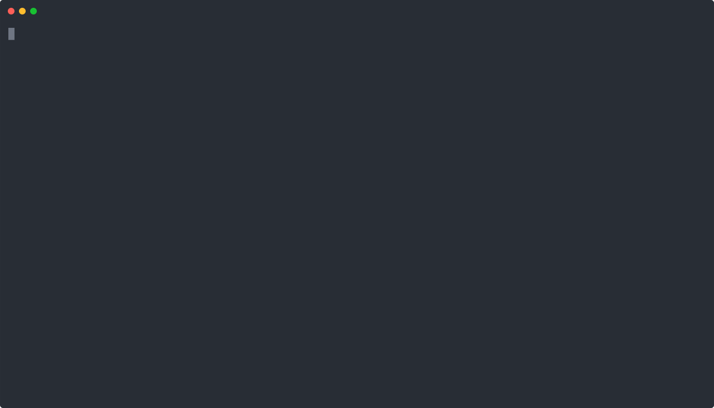

> Query California hydrogen station status from the CLI!



> (The tables will render correctly in your terminal if emojis are correctly configured).

# soss-cli
* 🤔 Query the [CAFCP](https://cafcp.org)'s
     Station Operational Status System (SOSS) from the command line
     
* 🛰️ Use geolocation to locate nearest stations

* ⛳ Query stations near point of interest

## Installation 

You need npm or yarn installed. On macos, install [homebrew](https://brew.sh/) and run ```brew install npm```, on 
Debian-flavored Linux, run ```sudo apt-get install npm```.

Then, install globally using npm or yarn:
```sh
# With npm
npm install -g soss-cli

# With yarn
yarn global add soss-cli
```

The ```soss``` command will now be available.

## Querying

Running without parameters will automatically print help.

```sh
soss nearest
```
Will output a list of stations nearby. If you are running macos, CoreLocation will be used to locate you, otherwise we 
fallback to IP-based geolocation.

```
~ ❯❯❯ soss nearest                                                                                                                                ✘ 1
✔ Getting current location
✔ Getting station data
✔ Getting Station Status
╔═════════════╤═══════════════╤═════╤═════╤═════════════╤════════════════════════════════╗
║ 🚗  Distance│ 🏢  Name      │ H35 │ H70 │ 🕒  Updated │ 💬  Message                    ║
╟─────────────┼───────────────┼─────┼─────┼─────────────┼────────────────────────────────╢
║ 1.67 mi     │ West LA       │ ❌  │ ❌  │ 11:28:45 AM │ The station is offline for mai ║
║             │               │     │     │             │ ntenance, and we expect to reo ║
║             │               │     │     │             │ pen around Thursday, 3/1. In t ║
║             │               │     │     │             │ he interim, customers can use  ║
║             │               │     │     │             │ Santa Monica or other nearby s ║
║             │               │     │     │             │ tations. Please check back for ║
║             │               │     │     │             │ updates. We apologize for any  ║
║             │               │     │     │             │ inconvenience.                 ║
╟─────────────┼───────────────┼─────┼─────┼─────────────┼────────────────────────────────╢
║ 3.54 mi     │ Santa Monica  │ ✅  │ ✅  │ 11:33:44 AM │                                ║
╟─────────────┼───────────────┼─────┼─────┼─────────────┼────────────────────────────────╢
║ 4.64 mi     │ Fairfax-LA    │ ✅  │ ✅  │ 11:33:44 AM │ The Fairfax station will be of ║
║             │               │     │     │             │ fline for maintenance activiti ║
║             │               │     │     │             │ es all day on 3/6 through 3/7, ║
║             │               │     │     │             │ We will advise as soon as the  ║
║             │               │     │     │             │ station returns to operation.  ║
║             │               │     │     │             │ We apologize for any inconveni ║
║             │               │     │     │             │ ence this may cause.           ║
╟─────────────┼───────────────┼─────┼─────┼─────────────┼────────────────────────────────╢
║ 7.42 mi     │ Playa Del Rey │ ✅  │ ✅  │ 11:31:57 AM │                                ║
╟─────────────┼───────────────┼─────┼─────┼─────────────┼────────────────────────────────╢
║ 7.50 mi     │ Hollywood     │ ✅  │ ✅  │ 11:21:55 AM │                                ║
╚═════════════╧═══════════════╧═════╧═════╧═════════════╧════════════════════════════════╝
```

You can also ask for stations near a particular POI. We use [openstreetmap](https://www.openstreetmap.org/) to
resolve addresses:

```
~ ❯❯❯ soss nearest disneyland
✔ Getting station data
✔ Getting Station Status
╔═════════════╤═══════════════╤═════╤═════╤═════════════╤════════════════════════════════╗
║ 🚗  Distance │ 🏢  Name     │ H35 │ H70 │ 🕒  Updated  │ 💬  Message                    ║
╟─────────────┼───────────────┼─────┼─────┼─────────────┼────────────────────────────────╢
║ 5.62 mi     │ Anaheim       │ ❌  │ ✅  │ 10:57:15 AM │ This station will reduce its e ║
║             │               │     │     │             │ nergy consumption (to reduce H ║
║             │               │     │     │             │ 2 costs!) between 12 midnight  ║
║             │               │     │     │             │ to 5 AM daily.   Safe, complet ║
║             │               │     │     │             │ e fills will still be achieved ║
║             │               │     │     │             │ during this period, they will  ║
║             │               │     │     │             │ just require a few minutes lon ║
║             │               │     │     │             │ ger than routine.              ║
╟─────────────┼───────────────┼─────┼─────┼─────────────┼────────────────────────────────╢
║ 10.72 mi    │ UC Irvine     │ ✅  │ ✅  │ 11:03:48 AM │                                ║
╟─────────────┼───────────────┼─────┼─────┼─────────────┼────────────────────────────────╢
║ 11.16 mi    │ Costa Mesa    │ ✅  │ ✅  │ 11:02:09 AM │                                ║
╟─────────────┼───────────────┼─────┼─────┼─────────────┼────────────────────────────────╢
║ 12.98 mi    │ Newport Beach │ ✅  │ ✅  │ 11:09:00 AM │                                ║
╟─────────────┼───────────────┼─────┼─────┼─────────────┼────────────────────────────────╢
║ 14.16 mi    │ Diamond Bar   │ ✅  │ ⚠️  │ 11:03:47 AM │                                ║
╚═════════════╧═══════════════╧═════╧═════╧═════════════╧════════════════════════════════╝
```

To query an individual station, you can use the status command:
```
~ ❯❯❯ soss status hayward
✔ Getting Station Status
✔ Getting station data
╔═══════╤═════════╤═════╤═════╤═════════════╤════════════════════════════════╗
║ 🆔  ID│ 🏢  Name│ H35 │ H70 │ 🕒  Updated  │ 💬  Message                    ║
╟───────┼─────────┼─────┼─────┼─────────────┼────────────────────────────────╢
║ 15023 │ Hayward │ ✅  │ ✅  │ 11:02:13 AM │                               ║
╚═══════╧═════════╧═════╧═════╧═════════════╧════════════════════════════════╝
```

Providing no argument will print all stations in the system.

#

This project is not affiliated in any way with the California Hydrogen Fuel Cell Partnership.

